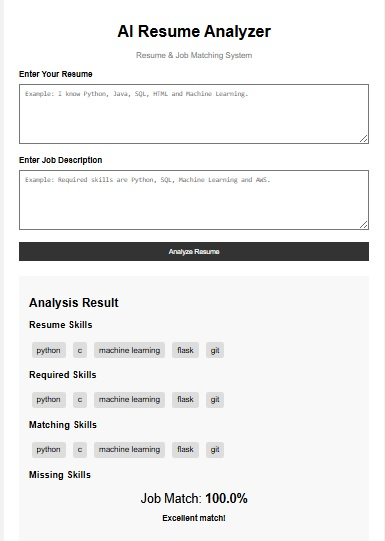

# AI Resume Analyzer & Job Matcher

A simple web-based application that analyzes a resume and compares it with a job description. It identifies matching skills, missing skills, and calculates a job match percentage.

## 📌 Project Overview

The **AI Resume Analyzer & Job Matcher** helps students and job seekers understand how well their skills match a particular job description.

The application takes:

* Resume text
* Job description

It then:

* Identifies skills from the resume
* Identifies required skills from the job description
* Finds matching skills
* Finds missing skills
* Calculates the job match percentage
* Provides a simple suggestion
## 📸 Application Screenshot

Here is a screenshot of the working AI Resume Analyzer:


## ✨ Features

* 📝 Enter resume details
* 💼 Enter job description
* 🔍 Detect technical skills
* ✅ Display matching skills
* ❌ Display missing skills
* 📊 Calculate job match percentage
* 💡 Provide improvement suggestions
* 🌐 Simple web interface

## 🛠️ Technologies Used

* **Python**
* **Flask**
* **HTML**
* **CSS**

## 📂 Project Structure

```text
AI_Resume_Analyzer/
│
├── app.py
│
├── templates/
│   └── index.html
│
├── static/
│   └── style.css
│
└── .gitignore
```

## ⚙️ How to Run

### 1. Clone the repository

```bash
git clone https://github.com/jahnavireddy1897/AI-Resume-Analyzer.git
```

### 2. Open the project folder

```bash
cd AI-Resume-Analyzer
```

### 3. Install Flask

```bash
pip install flask
```

### 4. Run the application

```bash
python app.py
```

### 5. Open in browser

Go to:

```text
http://127.0.0.1:5000
```

## 🧠 How It Works

The application uses a predefined list of technical skills such as:

* Python
* Java
* C
* C++
* SQL
* HTML
* CSS
* JavaScript
* Machine Learning
* Flask
* Django
* AWS
* MongoDB
* Git

The program checks whether these skills are present in the resume and job description.

The match percentage is calculated using:

```text
Match Percentage =
(Matching Skills / Required Skills) × 100
```

## 📊 Example

If a job requires:

```text
Python, SQL, Machine Learning, AWS
```

And the resume contains:

```text
Python, SQL, HTML, Machine Learning
```

The result will be:

```text
Matching Skills:
Python
SQL
Machine Learning

Missing Skills:
AWS

Job Match:
75%
```

## 🚀 Future Improvements

* Upload resume as a PDF
* Extract text automatically from resumes
* Add more technical skills
* Use NLP for better skill detection
* Recommend suitable jobs
* Add resume scoring
* Add database support
* Improve UI design

## 👩‍💻 Project

**AI Resume Analyzer & Job Matcher**

Developed as a B.Tech CSE mini project.
